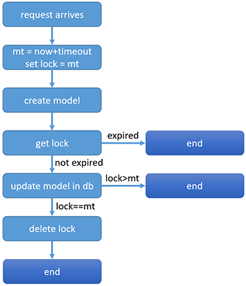

# AI Software Engineer Challenge

The goal of this challenge is to build a service that will use a forecasting model to make predictions
into the future.
The service should be composed of two different microservices:
1. A .NET broker to be used as the point of contact with other external services (the entrypoint of
the service we are building);
2. A Python processing unit that will use the forecasting model to compute the actual predictions.

## Run service

With docker and docker compose installed, run 'docker-compose --compatibility up -d'.

I've tested it in:
- Windows 10, Docker version 19.03.8, docker-compose version 1.25.4
- Centos 7, Docker version 19.03.4, docker-compose version 1.23.2

, although I suspect any OS that runs docker probably works.

## Requirements (original plus added)

- A single instance of the .NET broker should be enough for handling all of the incoming requests;
- Multiple instances of the Python processing unit should be required to handle all of the incoming requests;
- Whenever a new request for a forecast is made, if a new model is currently being created, ​thast request should be put on hold until the model creation is finished​, and should be computed using the newly created model, not the old model;
- The client wants to receive the results of the forecastting model back;
- The client wants to know if the creation of a new model succeded.

## Architecture
The overall architecture of the REST API is the one shown in the figure below:

The client requests one of the two endpoints through HTTP, which are processed by a .NET web server. This gateway service relays the requests to a message broker exchange, in this case RabbitMQ. The requests are then consumed by python microservices. These microservices process the requests and send the response back to the exchange. Once again, the exchange is responsible for relaying the responses back to the gateway which in turn responds to the original request.

My main concerns were:
- High scalability - we can simply deploy the same python services multiple times to get more requests processed;
- Easy extension of features - with the messaging protocol, we can easily add different services to get the same information, without disturbing the existing architecture;
- Simplicity over complexity;
- Ease of use for the client - request and immediate response, no need to do additional requests to find out about the request state;
- Ease of deployment and testing - I've conteneirized all the services, which can easily be deployed with docker-compose.

**Protocols**

All client requests will be performed through HTTP. All communications between the gateway and the microservices will be performed through AMQP.

In order to have a unified protocol for the content, all the request and responses, both performed by the gateway and the microservices, will use JSON. All responses will use the [JSend specification](https://github.com/omniti-labs/jsend).

### 1. __Rabbit__

All rabbit related files can be found in the rabbit folder.

RabbitMQ service is the central piece in the architecture. As is usually the case, we need to have an exchange, producers, queues, bindings and consumers.

**Single Queue or Multiple Queues?**

As can be seen from the image above, I decided to create separate queues for each type of request and response, thus requiring a topic exchange. In truth, the same could be achieved with only 1 queue for all requests and 1 queue for all responses, specifying the type of request in the routing key or message properties. However, this approach would not be very scalable, since, if we had many more endpoints, the queues would start to decrease in performance and it would be much more complicated to subscribe to a particular type of message. By using one queue for each endpoint with a topic exchange one has much more control and a more scalable solution than a fanout exchange or a direct exchange.

**Single point of failure**

Being so central in the architecture, the RabbitMQ server is a single point of failure. This could easily be addressed by creating a rabbitmq cluster with redundancy. For simplicity and resource scarcity, this was not done in this project.

**Who should create the queues?**

When a producer sends the message to an exchange, if there are no queues with the right routing key the messages will be lost. So who should create the queues? The gateway service? The microservices?

If the microservices are the ones creating the queues and they are not available, all requests will be lost. On the other hand, since we will not have requests wihtout the gateway service, it would make sense that this service would create the queues. However, this would mean that everytime we want to add a new service with a new queue, we would have to also change and redeploy the gateway.

Therefore, the best option is to have neither of them creating the queues. In fact, I opted to having the exchanges, the queues, the bindings and the dead-letter exhange in the rabbit configuration file. This way we can easily create new queues as needed, even without taking the service down.

### 2. __Gateway__

All gateway related files can be found in the gateway folder.

For the gateway I chose to use the .NET Core webapi framework, which allows for creating advanced RESTful services.

The gateway is also a single point of failure, which could easily be solved with a load balancer.

#### REST API: Request/Response vs Request/Acknowledge/Poll

I debated for a long time if the classic request/response solution was the best one in this sittuation. Both have cons and pros:
- Request/Response - the client requests and waits for a response. More convenient and easy to understand by the client;
- Request/Aknowledge/Poll - the client requests, gets a response with "requestID accepted" and periodically requests another endpoint to know if the requestID is complete. It's a more robust solution.

The problem with the request/response approach is that if the backend takes a very long time to respond, the request can timeout or the http connection can go down, and the client will never know what happened.

Analysing our endpoints, we can see that, when forecasting, it doesn't really matter if the connection is lost. The client can just forecast again and almost no harm is done. Regarding the fit_model endpoint, if the connection is lost, the client doesn't know if the model creation succeeded or not, and some forecasts can even be performed with the old model. If we design the fit_model endpoint to be idempotent, we can minimize the loss (the client makes the fit_model request again).

Although I came to the conclusion that, in this case, we should have a request/response approach for one endpoint and a request/aknowledge/poll for another, for simplicity, I implemented both as a request/response approach.

However, it would not be too difficult to change the architecture by persisting the message in redis, instead of in memory, and add a 3rd enpoint for the client to check the status of his request, given an id.

#### Components
The service is composed, essentially, off the following 4 components:
- Controllers;
- Consumers;
- Message repository;
- Request and response models.

#### Controllers

To handle the http requests, 2 controllers were created:
- FitModelController, for the fit_model endpoint;
- ForecastController, for the forecast endpoint

Both controllers follow, essentially, the same steps:
1. Accept post request enforcing the required json schema;
2. Assign a messageId to the request;
3. Insert an async task in the message repository, associated with the messageId. A timeout is added to this task, to guarantee that the client doesn't wait indefinetly in case of some catatrophic failure in the backend;
4. Publish the message to the rabbitmq exchange;
5. Wait for consumer to notify the response is ready;
6. Return response.

The controllers work assynchronously, as well as the consumer tasks, which guarantees we can process multiple requests in parallel.

We decided to make use of the HTTP codes to inform the client on the request's overarching result. To make things simple, we only return 3 status codes explicitly:
- 200 (Ok) if the request succeeded;
- 400 (bad request) if the request failed due to the input data;
- 500 (internal server error) if the request failed due to unexpected errors.

Note, however, that the .Net webapi is designed in such a way that it automatically detects certain unexpected errors (for instance, no body in the request), and will return the appropriate error code implicitly. This also adds another "problem": although I stated earlier that all response messages would follow the JSend specification, the implicit error

Examples:
- If a message doesn't have the necessary schema, the response will be a 400;
- If a fit_model doesn't have enough data points, the response will be 400;
- If a timeout occurs, the response will be 500;

#### Consumers

In order to receive the response messages that will be returned to the client, 2 consumers were created:

1. FitModelConsumer, to receive the fit_model response messages;
2. ForecastConsumer, to receive the forecast response messages.

These consumers expect the incoming messages to be in JSend format and they will nack any message that comes with another format.

When a message arrives to the consumer, the following steps are taken:
1. Retrieve the messageId;
2. Retrieve the task associated with the messageId from the message repository;
3. Notify the controller that the task has finished;
4. Acknowledge the message.

Message not aknowledged conditions:
- If a message arrives and can't be parsed as JSend;
- If a message arrives but the task timeout already occured;
- If a message arrives with a messageId that doesn't exist in the message repository.

It is important to note that all response messages that are successful or failed will be acknowledged, only the errors will be not acknowledged and sent to dead letter, where another service could potentially subscribe and process them. I think it makes sense to aknowledge the fails, since they are requests that were not performed correctly and have nothing to do with service unavailability or timeout. They will always produce the same fail status.

#### Swagger

I added swagger to simplify the api documentation and ease of use. Please check http://localhost:5000/swagger after the service is launched.

The swagger.json configuration can be found at: http://localhost:5000/swagger/v1/swagger.json

### 3 Redis

All redis related files can be found in the redis folder.

In order to persist the latest fitted_model, to be used by all forecasting agents, and to facilitate the locking mechanism, I decided to use redis, since it is a lightweight, fast, in-memory database. Redis could also be used as a message broker, but I'm more familiar with RabbitMQ.

It is important to note that redis does not have any pre-existing model, which means no forecast can be made prior to fitting a model. 

### 4 Python model

All rabbit related files can be found in the pythonService folder.

Regarding the python service, I decided to split the fit and forecast actions in 2 different microservices. This allows us to:
1. Launch a number of fit and forecast services independently of each other, according to the load and the time each one takes; 
2. Keep the python service as simple as possible, with only 1 consumer each and single-threaded;
3. Modify and redeploy the services independently.

The forecast service will:
1. Start consumer;
2. Validate incoming message;
3. Check for lock in redis on latest model. If locked, wait until unlocked;
3. Get latest model;
4. Forecast data;
5. Publish forecasted data

The fit_model will:
1. Start consumer;
2. Validate incoming message;
3. Lock latest model in the redis database;
4. Create model;
5. Update latest model and release lock.

#### Locking

The requirement

`Whenever a new request for a forecast is made, if a new model is currently being created, ​that request should be put on hold until the model creation is finished​, and should be computed using the newly created model, not the old model.`

is what really adds complexity to the python service. I thought about many ways of doing this:

1. Having a sequencial pipe, with the fit service listening to all the requests, processing the fit requests and passing on the forecasting requests, thus locking the forecasting requests while fitting a request. However, since we could launch multiple fit services, the fit services would have to communicate between each other, and it's not clear how that would work;

2. Having the fit services publish a "creating new model" message and "finished creating new model" message and all the forecasting services listening to those events. This would make the services having to listen to multiple queues, becoming much more complex.

None of these solutions seemed satisfactory.

The simplest way to do this, and probably the best way, is to just persist the latest model to a database. The forecast services just have to get that latest model. The fit services have to lock the model while fitting and, when finished, update the model and unlock it.

However, we have to be very careful about the locking implementation. The main problems are:
1. If a service locks the resource and dies, we can't have a dead lock;
2. Unlike most distributed scenarios, we actually want the services to acquire the lock even if it's already locked. However, we don't want a previous service to unlock the lock if a more recent lock was performed. 

I ended up having to actually implement the lock in the following way:

Essentially, the service locks the model with a future timestamp. If the lock existed, it adds to the timestamp. If the timestamp expired, the lock is not active anymore.

This way we guarantee that:
- If a service dies after locking, the lock timeout will avoid deadlocks;
- If 2 services try to acquire the lock, they can and the last one to lock will release the lock when finished

The main problems with this approach are:
- It may happen that a service will fit the model and the model will never be used, either because another fit request appeared or because the lock alread expired. The only problem with this is that we are wasting recources;
- If we are continuously flooded with fit_model requests, the forecasting requests will never be processed.

### 5. Docker encapsulation

I decided to use docker to encapsulate the services and docker-compose to orchestrate them. Each of the 4 services have its own Dockerfile, which is built using a docker-compose file.

The dockwe-compose also creates 2 networks, one for the frontend(gateway) and another for the backend (python services). RabbitMQ has access to both, while redis only has access to the backend network. This way, they are truly isolated.

All services need to have a variables.env file to run.

Since we want multiple python services, the docker-compose file deploys 6 fit services and 3 forecast services.

### 6. Improvements

Although I'm fairly happy with the solution proposed and with the robustness of the code, many improvements could be made. I've talked about most of them along this document.

One of the main problems might happen if the rabbit server goes down. The gateway will never recover, unless restarted. A bad way to deal with this is just restart the service on failure, which is what I did with docker-compose. Better ways are needed, like adding onDisconnection callbacks to the rabbit connection.

I didn't have much time to test and debug the services properly. I'm sure there are bugs in boundary conditions.

The logs and documentation of the code also need improvement.

I'd love to have the opportunity to improve on this solution.
